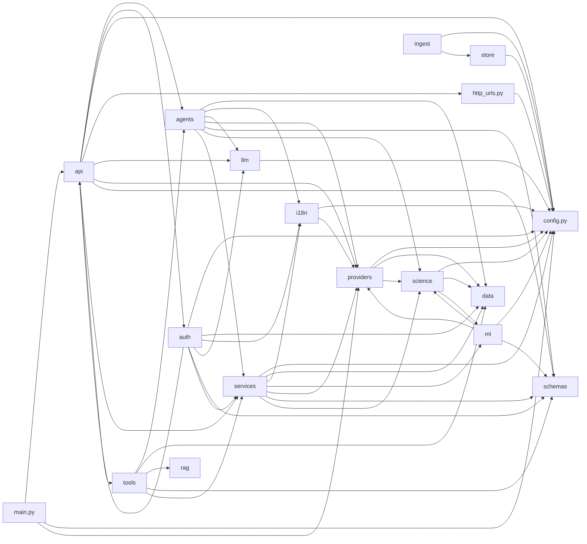

# Code graph (generated)

Generated `2026-09-19T03:06:31Z`. 265 files, 543 import edges.
Refresh: `python backend/scripts/codebase_graph.py`.

## Largest files

| Lines | Path |
|---|---|
| 1562 | `frontend/src/components/PredictionsPanel.tsx` |
| 1549 | `frontend/src/components/MapView.tsx` |
| 1518 | `frontend/src/components/overview/cards.tsx` |
| 1282 | `frontend/src/i18n/copy.ts` |
| 1138 | `backend/app/agents/orchestrator.py` |
| 1105 | `frontend/src/components/SquareMap.tsx` |
| 1080 | `frontend/src/lib/laymanSummaries.ts` |
| 1075 | `backend/app/science/nowcast.py` |
| 1009 | `frontend/src/components/overview/RiskAlertPanel.tsx` |
| 987 | `backend/app/services/alerts.py` |
| 964 | `backend/app/providers/open_meteo.py` |
| 918 | `frontend/src/types/dashboard.ts` |
| 853 | `backend/app/science/storm_map.py` |
| 847 | `frontend/src/components/Forecast7DayDeck.tsx` |
| 844 | `frontend/src/components/overview/rainWind.tsx` |
| 806 | `backend/app/agents/facts.py` |
| 778 | `frontend/src/components/SkyRainHero.tsx` |
| 732 | `backend/app/agents/insight_compiler.py` |
| 724 | `backend/app/services/snapshot_assemble.py` |
| 687 | `frontend/src/components/overview/alertModel.ts` |
| 664 | `frontend/src/components/SettingsPanel.tsx` |
| 621 | `frontend/src/components/ChatDock.tsx` |
| 599 | `backend/app/agents/binder.py` |
| 583 | `backend/app/science/sat_kalman.py` |
| 556 | `backend/app/agents/utterance.py` |

## Buckets

- **__init__.py**: 1 files
- **agents**: 24 files
- **api**: 9 files
- **auth**: 8 files
- **cache.py**: 1 files
- **clients**: 4 files
- **config.py**: 1 files
- **data**: 11 files
- **fe-app**: 4 files
- **fe-components**: 42 files
- **fe-i18n**: 2 files
- **fe-lib**: 12 files
- **fe-types**: 1 files
- **http_urls.py**: 1 files
- **i18n**: 7 files
- **ingest**: 4 files
- **llm**: 4 files
- **main.py**: 1 files
- **ml**: 35 files
- **mobile**: 4 files
- **providers**: 27 files
- **rag**: 2 files
- **schemas**: 7 files
- **science**: 32 files
- **services**: 13 files
- **store**: 6 files
- **tools**: 2 files

## How agents should use this

1. Read `docs/CODEMAP.md` for “where to change X”.
2. Open `docs/codegraph.json` and filter `nodes`/`edges` by path prefix.
3. Follow `from` → `to` edges to see what a change will touch.

## Backend package edges (collapsed)

