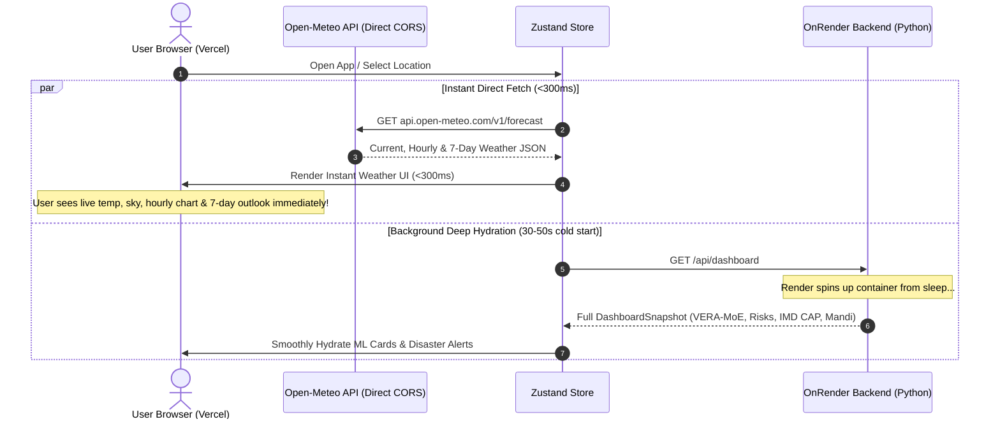

# Architectural Plan: Client-Side Open-Meteo Direct Fetch & Optimistic Hydration

**Status:** Saved for later implementation  
**Target Environments:** Vercel (Frontend) + OnRender (Backend)

---

## 1. Objective

When Rituchakra is deployed with the frontend on Vercel and backend on Render's free tier, the backend spins down after 15 minutes of inactivity. When a user visits the site, Render's cold start takes **50–90 seconds**, during which the user faces a blank loading screen or timeout errors. Additionally, routing all Open-Meteo requests through a single Render server IP risks hitting Open-Meteo's 10,000 requests/day free-tier rate limit.

This plan outlines how to enable the **client browser to query Open-Meteo directly**, delivering instant sub-300ms weather, eliminating rate-limit bottlenecks, and optimistically hydrating the UI while Render wakes up in the background.

---

## 2. Architecture & Data Flow

---

## 3. Capability Matrix

| Feature | Direct Open-Meteo (Client) | Handled by Render Backend |
| :--- | :---: | :---: |
| **Raw Weather Variables** (Temp, rain, wind, humidity, cloud cover) | ✅ Instant (<300ms) | ✅ Proxied & cached |
| **GloFAS River Discharge & Marine Waves** | ✅ Direct | ✅ Snapped to nearest coast |
| **CAMS Air Quality (Atmospheric model)** | ✅ Direct | ✅ Blended with ground sensors |
| **Official IMD CAP Warnings & Sachet Alerts** | ❌ No | ✅ Fetched from NDMA / IMD RSS & XML feeds |
| **CPCB Ground Station National AQI** | ❌ No | ✅ Fetched from data.gov.in (API key required) |
| **Agmarknet Mandi Crop Prices** | ❌ No | ✅ Fetched from data.gov.in (API key required) |
| **USGS Earthquakes & INCOIS Tsunami Bulletins** | ❌ No | ✅ Aggregated from seismic feeds |
| **VERA-MoE Machine Learning Blend** | ❌ No | ✅ Python ensemble (ECMWF, GFS, ICON, GraphCast) |
| **Hydrological Hysteresis & Runoff Limb** | ❌ No | ✅ Custom physics calculations |
| **Regret-Theory Irrigation Advice** | ❌ No | ✅ Computed by backend science engine |
| **Multi-Hazard Risk Engine** (Cloudburst, Kal Baisakhi, Flood) | ❌ No | ✅ Computed in `backend/app/ml/risk.py` |
| **AI Agronomic Advisor (`/chat`)** | ❌ No | ✅ Streaming LLM / Ollama with grounded data |

---

## 4. Proposed Implementation Steps

### Step 1: Create Client-Side Open-Meteo Engine
- **File:** `frontend/src/lib/openMeteoClient.ts`
- Implement `fetchDirectOpenMeteo(lat, lon, location)`:
  - Queries `https://api.open-meteo.com/v1/forecast` with `current`, `hourly`, and `daily` parameters.
  - Queries `https://air-quality-api.open-meteo.com/v1/air-quality` for US AQI, PM2.5, PM10.
  - Formats WMO weather codes into human-readable sky labels matching `backend/app/ml/sky.py`.
  - Calculates wind compass directions and rose distributions.
- Implement `buildOptimisticSnapshot(loc, omData, aqiData)`:
  - Generates a fully-typed `DashboardSnapshot` with realistic default structures for risks and models.
  - Sets `backend_status: "direct"` and `is_optimistic: true`.

### Step 2: Fallback Place Search & Geocoding
- **File:** `frontend/src/lib/api.ts`
- Enhance `searchPlaces(q)`:
  - Add a 1.8-second timeout to the Render `/geo/search` call using `AbortController`.
  - On timeout or failure, seamlessly fall back to `https://geocoding-api.open-meteo.com/v1/search?name=${q}&count=10&countryCode=IN`.
  - Map geocoding results directly into the `Location` type so search remains operational even during Render sleep.
- Enhance `reverseGeocode(lat, lon)`:
  - Fall back to Open-Meteo reverse lookup if Render is asleep.

### Step 3: Store State & Dual Hydration
- **File:** `frontend/src/lib/store.ts`
- Introduce connection tracking: `backendStatus: "connecting" | "synced" | "direct" | "offline"`.
- Update `refresh()` and `setLocation(location)`:
  1. Trigger `fetchDirectOpenMeteo(location)` immediately.
  2. As soon as direct weather arrives, set `dashboard` to the optimistic snapshot and `status: "ready"` (UI displays instantly).
  3. In parallel, dispatch `fetchDashboard(location)` to Render.
  4. When Render responds, hydrate the snapshot with full VERA-MoE models, IMD CAP alerts, and Mandi prices; set `backendStatus: "synced"`.
  5. If Render fails or times out, keep the direct weather dashboard active and mark `backendStatus: "direct"` without crashing.

### Step 4: UI Status Pill & Resilience
- **File:** `frontend/src/app/page.tsx`
- Add a sleek status indicator in the top header:
  - `backendStatus === "connecting"`: `⚡ Instant Weather • Waking AI Models...` (with subtle pulsing dot).
  - `backendStatus === "synced"`: Auto-fades or shows `✓ AI Models Active`.
  - `backendStatus === "direct"`: `⚠️ Standalone Weather Mode (AI Offline)`.
- Ensure components render smoothly when `is_optimistic: true` (gracefully hiding or skeletoning the empty risk/model tabs until hydrated).

---

## 5. Alternative / Complementary Operational Solution

To prevent Render free tier from sleeping in the first place:
- Set up an uptime monitor (e.g. [cron-job.org](https://cron-job.org) or [UptimeRobot](https://uptimerobot.com)) to ping `https://rituchakra-api.onrender.com/health` every **10 to 12 minutes**.
- This keeps the Render container warm 24/7 at no cost, completely eliminating the 50s cold start.
